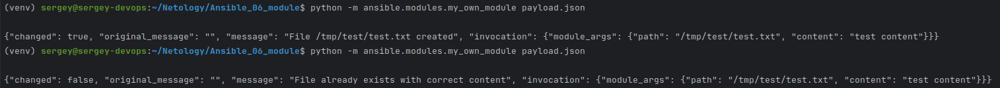
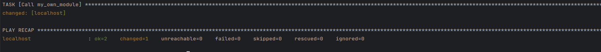
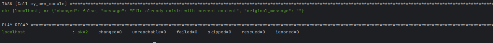
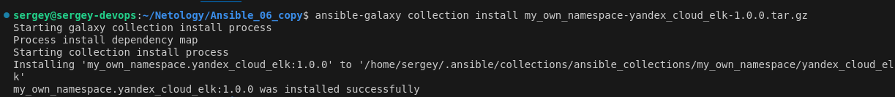
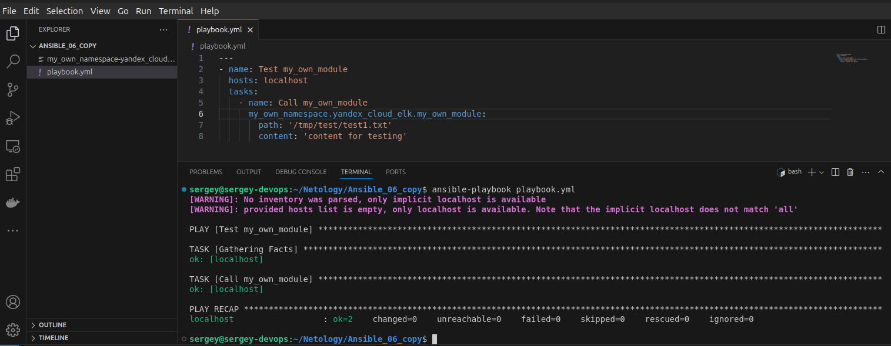

[Задание](https://github.com/netology-code/mnt-homeworks/blob/MNT-video/08-ansible-06-module/README.md)

## Подготовка
- Создаём каталог для проекта
- Внутри этого каталога `git clone https://github.com/ansible/ansible.git`
- `cd ansible`
- `python3 -m venv venv`
- `. venv/bin/activate`
- `pip install -r requirements.txt`
- `. hacking/env-setup`
- `deactivate`
- `. venv/bin/activate && . hacking/env-setup` (находясь в директории со склонированным репозиторием ansible)

## Основная часть
- Создаём [файл](ansible/lib/modules/my_own_module.py) с содержимым из [примера](https://docs.ansible.com/ansible/latest/dev_guide/developing_modules_general.html#creating-a-module)
- Располагаем его в `lib/ansible/modules`
- Пишем параметры в [payload.json](payload.json)
- Запускаем `python -m ansible.modules.my_own_module payload.json`    
    
При втором запуске, как и ожидалось, другой ответ.
- Создаём [playbook.yml](playbook.yml)
- Запускаем `ansible-playbook playbook.yml`    
  
- Повторный запуск даёт другой результат, что подтверждает идемпотентность:  
  
- Деактивируем окружение `deactivate`
- Создаём новую коллекцию:  
`ansible-galaxy collection init my_own_namespace.yandex_cloud_elk`
- Внутри создаём директорию `modules`: `mkdir my_own_namespace/yandex_cloud_elk/plugins/modules`
- Копируем туда наш модуль `cp ansible/lib/ansible/modules/my_own_module.py my_own_namespace/yandex_cloud_elk/plugins/modules`
- Переходим в нашу коллекцию `cd my_own_namespace/yandex_cloud_elk`
- Создаём роль внутри коллекции: `ansible-galaxy role init roles/my_own_role`
- Переносим task из [playbook.yml](playbook.yml) в [roles/my_own_role/tasks/main.yml](my_own_namespace/yandex_cloud_elk/roles/my_own_role/tasks/main.yml)
- Создаём task для роли в [my_own_namespace/yandex_cloud_elk/playbook_for_role.yml](my_own_namespace/yandex_cloud_elk/playbook_for_role.yml)
- Запускаем `ansible-playbook playbook_for_role.yml`
- Создаём репозиторий внутри директории `my_own_namespace/yandex_cloud_elk`, коммитим, пушим, тегаем. Результат [здесь](https://github.com/SergueiMoscow/Ansible_06_collection/tree/1.0.0)
- `ansible-galaxy collection build`
- [Tar.gz archive](https://github.com/SergueiMoscow/Ansible_06_collection/blob/main/my_own_namespace-yandex_cloud_elk-1.0.0.tar.gz)
- Создаём папку `Ansible_06_copy`, копируем туда playbook.yml и архив.
- Создаём коллекцию из архива `ansible-galaxy collection install my_own_namespace-yandex_cloud_elk-1.0.0.tar.gz`  

- Запускаем playbook: `ansible-playbook playbook.yml`  

